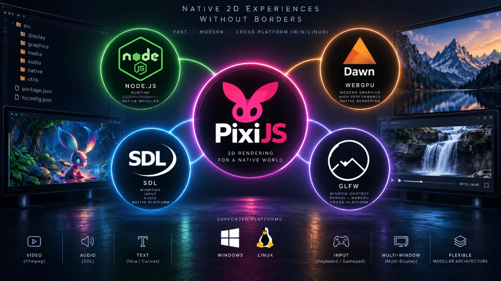

# Pixi Native

Pixi Native runs PixiJS in a native Node.js window. It provides the small
browser-shaped surface that Pixi needs, then connects Pixi to native WebGPU or
WebGL rendering, window input, Canvas2D, audio, video, and file access. Display
applications do not need a browser, WebView, or CEF process.

> [!NOTE]
> Version 0.1.2 is a pre-release. The API and native package layout may change
> before 1.0.



## What is included

- PixiJS 8 with WebGPU or WebGL, plus PixiJS 7 with WebGL.
- Managed native application startup, frame presentation, input, resizing, and
  teardown through `createApp()`.
- Native Canvas2D support for Pixi text, bitmap-font assets, and image loading.
- FFmpeg-backed file and live video with audio, seeking, source replacement,
  reconnect support, statistics, and side-by-side packed alpha.
- A Howler-style native audio API for effects, music, sprites, fades, and
  overlapping voices.
- Module-relative, read-only file helpers for packaged display assets.
- Optional GSAP and PixiPlugin integration, including animation during Windows
  move and resize loops.

Pixi Native implements the browser APIs that Pixi uses. It does not provide
HTML layout, CSS, navigation, browser media elements, or a general-purpose DOM.

## Package

Install `@matjash/pixi-native`. Its root export uses PixiJS 8. The
`/pixi8`, `/pixi7`, and `/core` subpaths expose the explicit facades and the
Pixi-neutral API. npm installs the matching Windows or Linux native package as
an optional platform dependency.

Applications should import Pixi and native helpers from one version facade.
Repository source paths and unexported `dist/` files are internal.

## Support matrix

Version 0.1.2 targets PixiJS 8.20.0 and PixiJS 7.4.3.

| Platform       | PixiJS 8 WebGPU | PixiJS 8 WebGL | PixiJS 7 WebGL | Audio         | Video                  |
| -------------- | --------------- | -------------- | -------------- | ------------- | ---------------------- |
| Windows 11 x64 | D3D12           | SDL/ANGLE GLES | SDL/ANGLE GLES | miniaudio     | FFmpeg, D3D11VA or CPU |
| Linux x64      | Vulkan          | SDL/EGL GLES   | SDL/EGL GLES   | miniaudio     | FFmpeg, VA-API or CPU  |

Both platforms use explicit renderer selection and fail when the requested
backend or native package is unavailable. The runtime does not switch to a
browser renderer or another backend.

## Install

Use Node.js 24.13 or newer from the Node.js 24 LTS line. The repository uses
pnpm 9.15.9.

Install the facade package together with the Pixi major used by the display:

```sh
pnpm add @matjash/pixi-native pixi.js@^8.20.0
# PixiJS 7 instead:
pnpm add @matjash/pixi-native pixi.js-v7@npm:pixi.js@^7.4.3
```

npm selects the matching x64 native package. The facade declares both Pixi
majors as optional peers and does not install either one. A launcher that uses
both majors can install both commands' Pixi dependencies, but each display must
run in a separate Node.js process and import one Pixi major.

## Create a starter project

The quickboot package creates a small TypeScript project with Sprite, Graphics,
Text, ticker animation, resize handling, and managed teardown:

```sh
pnpm dlx @matjash/create-pixi-native my-display --pixi 8 --backend webgpu
cd my-display
pnpm install
pnpm dev
```

Use `--backend webgl` for PixiJS 8 WebGL. Create a PixiJS 7 project with
`--pixi 7`; its backend is WebGL. Omit options in an interactive terminal to
answer prompts.

The generated project uses Node.js watch mode for source reloads, `tsc` for the
production build, and Prettier for formatting. The generator writes the files
and prints the next commands without installing dependencies.

## PixiJS 8 quick start

```ts
import {
  Assets,
  Sprite,
  createApp,
  createModuleFileAccess,
} from "@matjash/pixi-native";

const files = createModuleFileAccess(import.meta.url);
const runtime = await createApp({
  backend: "webgpu",
  width: 1280,
  height: 720,
  title: "Pixi Native",
  transparent: true,
});

const texturePath = files.resolvePath("../assets/character.png");
const texture = await Assets.load(texturePath);
runtime.app.stage.addChild(new Sprite(texture));
runtime.native.window.setPosition(100, 100);

runtime.addDestroyListener(() => Assets.unload(texturePath));
// Call await runtime.destroy() from your application shutdown path.
```

`backend: "webgpu"` selects WebGPU. Use `backend: "webgl"` for PixiJS 8
WebGL. Omitting `backend` selects WebGPU and still does not enable fallback.

## PixiJS 7 quick start

```ts
import { Graphics, createApp } from "@matjash/pixi-native/pixi7";

const runtime = await createApp({
  width: 1280,
  height: 720,
  title: "Pixi 7 Native",
});

const shape = new Graphics();
shape.beginFill(0x4f8cff).drawRoundedRect(40, 40, 240, 120, 16).endFill();
runtime.app.stage.addChild(shape);
```

PixiJS 7 uses WebGL. Do not import `pixi.js`, `pixi.js-v7`, or the other Pixi
Native version facade in the same display process.

## Documentation

- [Documentation index](docs/README.md)
- [Getting started](docs/getting-started.md)
- [Application lifecycle and API](docs/application-and-api.md)
- [Pixi Native API reference](docs/api-reference.md)
- [Media and files](docs/media-and-files.md)
- [GSAP integration](docs/integrations/gsap.md)
- [Deployment and release archives](docs/deployment.md)

Package tarballs include these guides and the public TypeScript declarations.

## Current limitations

- Windows transparency uses the compositor path. Linux transparency uses X11
  or XWayland, an ARGB window visual, and an active desktop compositor. WebGPU
  accepts premultiplied or verified X11 inherited alpha; unsupported surfaces
  use an opaque background with a warning. Pure Wayland is not supported.
- Transparent pixels still receive pointer input. The public API does not
  provide click-through windows or custom title bars.
- Native video outputs SDR BT.709 limited-range NV12. The decoder-to-GPU path
  still performs a copy.
- Live video sources do not support seeking and require playback rate `1`.
- `maxFps` applies from 24 to 360 FPS when `vsync` is false. With `vsync: true`,
  VSync owns pacing.

## Repository development

On Linux, the patched SDL and EGL bindings compile during `pnpm install`.
Install a C++ toolchain, Python 3, and the X11, XRender, EGL and GLES development
headers (Ubuntu/Debian: `build-essential python3 libx11-dev libxrender-dev
libegl1-mesa-dev libgles2-mesa-dev`). Keep the pnpm patches and package extensions
when installing this workspace; unpatched upstream binaries omit this support.

With a composited X11/XWayland desktop, run the native transparency checks with
`PIXI_NATIVE_TEST_TRANSPARENCY=1 node --test tests/linux-transparency.test.ts`.
These checks open temporary windows and exercise alpha and resizing.

```sh
pnpm install
pnpm typecheck
pnpm test
```

Run one demo backend:

```sh
pnpm dev:webgpu
pnpm dev:webgl
pnpm dev:webgl7
```

The demo covers Sprite, Graphics, Text, BitmapText, ticker animation, video,
audio, transparency, resizing, and presentation. Use number keys `1` through
`9` or the arrow keys to change scenes.

Create the platform-specific release archives from the full development
installation:

```sh
pnpm pack:dist
```

This command checks types and tests, compiles the TypeScript packages, validates
native artifacts, creates checksummed archives, and installs them into a fresh
production consumer. It uses existing native addons and FFmpeg binaries.

## Acknowledgements

Pixi Native builds on [PixiJS](https://pixijs.com/),
[Dawn and Tint](https://dawn.googlesource.com/dawn/),
[SDL](https://www.libsdl.org/), [webgl-node](https://github.com/monteslu/webgl-node),
and [native-gles](https://github.com/monteslu/native-gles). The Node.js
integration also uses
[@napi-rs/canvas](https://github.com/Brooooooklyn/canvas),
[napi-rs](https://napi.rs/), [miniaudio](https://miniaud.io/), and
[FFmpeg](https://ffmpeg.org/).

Thanks to the maintainers and contributors of those projects. Their work makes
the native renderer, window, canvas, audio, and media layers possible. See
[Third-party notices](THIRD_PARTY_NOTICES.md) for license and redistribution
details.

## License

Pixi Native uses the [MIT License](LICENSE). Third-party components retain
their own licenses; see [Third-party notices](THIRD_PARTY_NOTICES.md).
